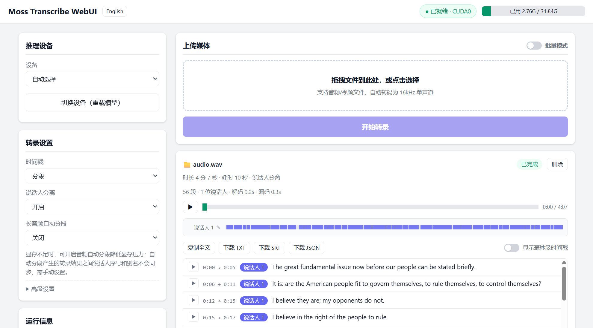

<div align="center">

# Moss Transcribe WebUI for transcribe.cpp

**中文** | [English](README_EN.md)

基于 [`transcribe.cpp`](https://github.com/handy-computer/transcribe.cpp) + [`Moss-Transcribe-Diarize`](https://github.com/OpenMOSS/MOSS-Transcribe-Diarize) 的**本地高性能**语音转写 WebUI，支持毫秒级时间戳与说话人分离。导入任意格式视频或音频，输出 TXT、SRT 或 JSON 转录结果，**GPU 加速 Ready**，4分钟音频推理只需10秒钟。

[](LICENSE)
[](https://github.com/TigerSHe1998/Moss-Transcribe-WebUI/releases)
[](https://github.com/TigerSHe1998/Moss-Transcribe-WebUI/releases)



[前往下载](https://github.com/TigerSHe1998/Moss-Transcribe-WebUI/releases)

</div>

## 环境准备

需要安装 Python 3.10 以上版本。请访问 [Python官网](https://www.python.org/downloads/) 。

（若使用 Releases 中的快速部署包，以下文件均已就绪，只需运行一键脚本即可。）

1. 请将 ffmpeg 放到 `resources\ffmpeg` 文件夹。指引：[FFMPEG_Guide](resources/ffmpeg/#PUT_FFMPEG_HERE)
2. 请将 MOSS-Transcribe-Diarize 的 gguf 模型放到 `resources\model` 文件夹。指引：[GGUF_Guide](resources/model/#PUT_MOSS_GGUF_HERE)
3. 请将 transcribe_cpp_native_cu12 的 whl 放到 `resources\whl` 文件夹（仅用于CUDA GPU加速）。指引：[WHL_Guide](resources/whl/#PUT_WHL_HERE)

全部准备完成后，双击运行以下脚本一键部署。若依赖下载过程缓慢，请自备代理。

```bat
init_env.bat
```

## 启动 WebUI

```bat
run_webui.bat          :: 启动后本机访问 http://127.0.0.1:8390
```

可用参数：`-h/--help`、`--host`、`--port`、`-m/--model`（GGUF 路径，默认加载 `resources/model/` 下的模型）。

## 使用 CLI（高级用户）

`cli\transcribe.bat` 提供无需打开浏览器的一键转录，适合脚本调用或 AI Agent 集成。将 `cli` 文件夹加入 PATH 环境变量后即可便捷全局使用：

```bat
transcribe.bat meeting.wav                       :: 单文件转录（输出 meeting.txt）
transcribe.bat --batch ./recordings --output all :: 文件夹批量转录，输出 txt/srt/json
transcribe.bat --list-backend                    :: 列出可用推理后端
transcribe.bat voice.mp3 --autosplit 15          :: 长音频按 15 分钟自动分段
transcribe.bat voice.mp3 --host 192.168.50.2     :: 对接局域网内已运行的 WebUI 服务
```

CLI 会自动检测 WebUI 服务是否存在：已在运行则直接对接，本机无服务则自动启动并在完成后停止。

请运行 `transcribe.bat --help` 查看完整使用指南。

## Roadmap

- [X] **推理设备热切换**：CUDA / Vulkan / CPU 后端可在页面内切换，无需重启
- [X] **推理设备占用展示**：顶栏实时显示推理设备显存 / 内存占用条（70%/90% 变色预警）
- [X] **上传任意音频 / 视频**：自动调用本机 ffmpeg 转码为 16kHz 单声道（视频抽音轨、重采样、下混）
- [X] **说话人分离 + 时间戳**：转录前选项可调，结果可查看 / 复制 / 导出 TXT、SRT、JSON
- [X] **说话人别名**：点时间轴名字旁的 ✎ 可将「说话人 1」改为任意名字（如 Sam）
- [X] **时间戳精度**：结果卡片支持调整「显示毫秒级时间戳」开关（默认秒级）
- [X] **回听播放器**：播放/暂停、进度条拖拽、自动高亮对应文本并滚动跟随、时间轴色块跳转到对应条目
- [X] **长音频自动分段**：显存不足时可启用，按所选窗口（15/30/45/60 分钟）自动将音频切分为多个任务排队
- [X] **批量上传**：开启「批量模式」后支持一次选择多个文件，逐个自动上传排队
- [X] **English Support**：一键切换界面语言（中文 / English）
- [X] **CLI 供 Agent 快速转录**：`cli\transcribe.bat` 一键转录（单文件 / 文件夹批量），自动对接或拉起 WebUI 服务，支持全部转录选项与远程服务
- [ ] **热词支持**：transcribe.cpp 后端暂未适配 Moss 模型的热词输入，上游适配后跟进

## 其他说明

- 依赖（fastapi / uvicorn / python-multipart / numpy / transcribe-cpp）默认装入 `.venv`，不影响全局环境
- 任务结果服务重启后清空；回听音频在 `uploads/`，随任务删除或服务重启自动清理
