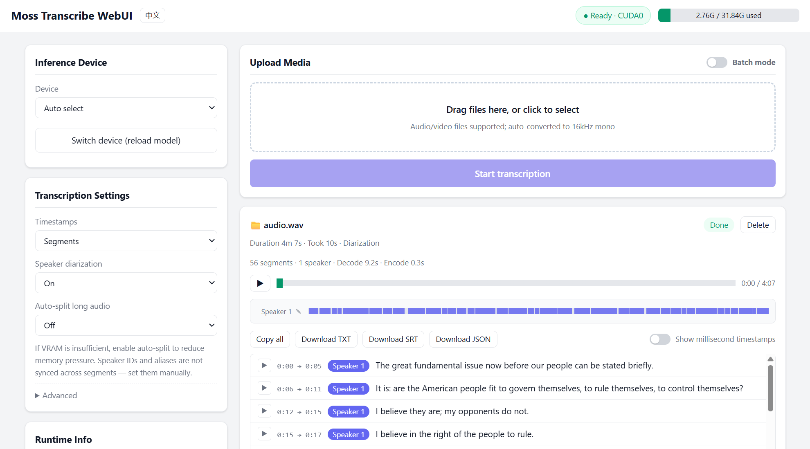

<div align="center">

# Moss Transcribe WebUI for transcribe.cpp

[中文](README.md) | **English**

A **high-performance local** speech transcription WebUI built on [`transcribe.cpp`](https://github.com/handy-computer/transcribe.cpp) + [`Moss-Transcribe-Diarize`](https://github.com/OpenMOSS/MOSS-Transcribe-Diarize), with millisecond-level timestamps and speaker diarization. Import audio or video in any format and export TXT, SRT, or JSON transcripts. **GPU acceleration Ready** — a 4-minute audio takes only 10 seconds to transcribe.

[](LICENSE)
[](https://github.com/TigerSHe1998/Moss-Transcribe-WebUI/releases)
[](https://github.com/TigerSHe1998/Moss-Transcribe-WebUI/releases)



[Download](https://github.com/TigerSHe1998/Moss-Transcribe-WebUI/releases)

</div>

## Prerequisites

Python 3.10 or newer is required. Visit [python.org](https://www.python.org/downloads/).

(If you use the quick-deploy package from Releases, the following files are already in place — just run the one-click setup script.)

1. Put ffmpeg into the `resources\ffmpeg` folder. Guide: [FFMPEG_Guide](resources/ffmpeg/#PUT_FFMPEG_HERE)
2. Put the MOSS-Transcribe-Diarize GGUF model into the `resources\model` folder. Guide: [GGUF_Guide](resources/model/#PUT_MOSS_GGUF_HERE)
3. Put the transcribe_cpp_native_cu12 wheel into the `resources\whl` folder (only needed for CUDA GPU acceleration). Guide: [WHL_Guide](resources/whl/#PUT_WHL_HERE)

Once everything is in place, double-click the script below for one-click deployment. If dependency downloads are slow, configure a proxy.

```bat
init_env.bat
```

## Starting the WebUI

```bat
run_webui.bat          :: serves at http://127.0.0.1:8390 after startup
```

Available options: `-h/--help`, `--host`, `--port`, `-m/--model` (GGUF path; defaults to the model under `resources/model/`).

## Using th CLI (Advanced Users)

`cli\transcribe.bat` offers one-shot transcription without opening the browser — ideal for scripts and AI Agent integration. Add the `cli` folder to PATH for global availability:

```bat
transcribe.bat meeting.wav                       :: single file transcription (writes meeting.txt)
transcribe.bat --batch ./recordings --output all :: batch a folder, writes txt/srt/json
transcribe.bat --list-backend                    :: list available inference backends
transcribe.bat voice.mp3 --autosplit 15          :: auto-split long audio every 15 minutes
transcribe.bat voice.mp3 --host 192.168.50.2     :: use a WebUI service on the LAN
```

The CLI detects the service automatically: if one is already running it attaches (and leaves it running afterwards); otherwise it starts a local service and stops it when finished. 

Run `transcribe.bat --help` for all options.

## Roadmap

- [X] **Hot device switching**: switch between CUDA / Vulkan / CPU backends in the UI, no restart needed
- [X] **Device memory usage**: live GPU / memory usage bar in the header (amber at 70%, red at 90%)
- [X] **Any audio / video input**: automatically transcoded to 16kHz mono via ffmpeg (audio extraction from video, resampling, downmixing)
- [X] **Speaker diarization + timestamps**: configurable before transcription; results can be viewed / copied / exported as TXT, SRT, JSON
- [X] **Speaker aliases**: click the ✎ next to a timeline name to rename "Speaker 1" to anything (e.g. Sam)
- [X] **Timestamp precision**: per-result toggle for millisecond-level timestamps (seconds by default)
- [X] **Playback player**: play/pause, draggable seek bar, automatic highlighting with scroll-follow of the matching text, timeline-bar click to jump to an entry
- [X] **Auto-split for long audio**: useful for low VRAM hardware — audio longer than the selected window (15/30/45/60 min) is automatically split into queued jobs
- [X] **Batch upload**: enable batch mode to select multiple files at once; they are uploaded and queued one by one
- [X] **Multilanguage support (中文 / English)**: one-click language toggle in the header
- [X] **CLI for Agent use**: `cli\transcribe.bat` one-shot transcription (single file / folder batch), attaches to or starts a WebUI service automatically, supports all transcription options and remote services
- [ ] **Hotwords**: the transcribe.cpp backend does not yet support hotword input for Moss models; will follow once upstream lands

## Notes

- Dependencies (fastapi / uvicorn / python-multipart / numpy / transcribe-cpp) are installed into `.venv` and never touch the global environment
- Job results are cleared on server restart; recall audio lives in `uploads/` and is cleaned up with the job or on restart
